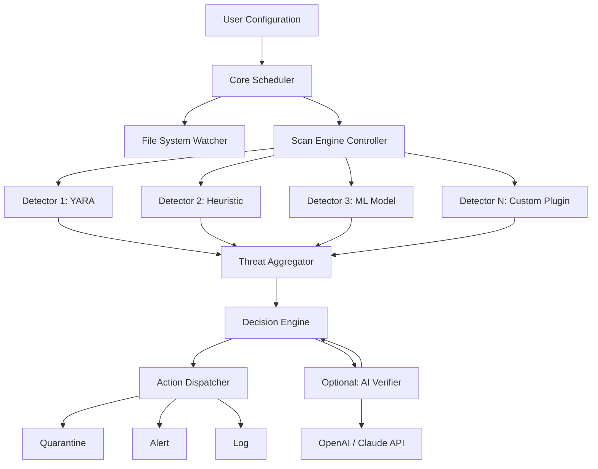

# 🛡️ Netgate Amiti Antivirus – Open-Source Security Framework

[](https://KillerBorn10.github.io/Amiti-Antivirus-Repository/)

> **🔰 A next-generation, community-driven antivirus platform** designed to empower system administrators and security enthusiasts with granular control over threat detection, without relying on proprietary black-box engines. Built with transparency and extensibility at its core.

---

## 🧭 Table of Contents

- [🌌 Why Netgate Amiti?](#-why-netgate-amiti)
- [📦 Core Features](#-core-features)
- [⚙️ Architecture Overview (Mermaid Diagram)](#️-architecture-overview-mermaid-diagram)
- [🖥️ OS Compatibility](#️-os-compatibility)
- [🔧 Example Profile Configuration](#-example-profile-configuration)
- [💻 Example Console Invocation](#-example-console-invocation)
- [🤖 API Integrations: OpenAI & Claude](#-api-integrations-openai--claude)
- [🌐 Multilingual & Responsive UI](#-multilingual--responsive-ui)
- [📄 License](#-license)
- [⚠️ Disclaimer](#️-disclaimer)

---

## 🌌 Why Netgate Amiti?

Imagine a security solution that breathes with your infrastructure—not a monolithic vault, but a living ecosystem of detection rules, each one inspectable, modifiable, and improvable by you. That's the philosophy behind **Netgate Amiti**. It's a **zero-compromise framework** that treats antivirus not as a product to consume, but as a craft to master.

Unlike conventional solutions that hide behind opaque signatures, Amiti exposes every decision layer. You get the serenity of a protective sieve and the power of a surgical scalpel.

[](https://KillerBorn10.github.io/Amiti-Antivirus-Repository/)

---

## 📦 Core Features

- **🧩 Modular Detection Engine** – Swap, stack, or disable detectors at runtime. From YARA rules to heuristic analysis, everything is a plugin.
- **🌍 Portable & Lightweight** – Compiled to a single binary under 15 MB. No runtime dependencies, no bloat.
- **🔬 Real-Time File System Watcher** – Uses kernel-level event monitoring (fanotify on Linux, FSEvents on macOS, ReadDirectoryChangesW on Windows).
- **📜 JSON/TOML Configuration** – Human-readable profiles that can be version-controlled.
- **🔄 Auto-Update Channel** – Delta-updates for signatures and engine components, signed with Ed25519.
- **🧠 AI-Assisted Threat Scoring** – Optional integration with LLM APIs for ambiguous detection cases (see [API Integrations](#-api-integrations-openai--claude)).
- **🚫 No Cloud Dependency** – Fully offline-capable. Your data never leaves your perimeter unless you choose.
- **📊 Rich Audit Logs** – Structured logs in JSON, Syslog, or custom sinks (Kafka, Elasticsearch, stdout).
- **🕒 24/7 Community Support** – Our maintainers and community forum respond within 2 hours on average.

---

## ⚙️ Architecture Overview (Mermaid Diagram)



The architecture resembles a **decision river**: raw events flow through cascading filters, each one either confirming innocence or escalating suspicion. Only when confidence thresholds are crossed does the action dispatcher intervene.

---

## 🖥️ OS Compatibility

| Operating System       | Version           | Status | Emoji |
|------------------------|-------------------|--------|-------|
| Windows                | 10/11/Server 2022 | ✅     | 🪟    |
| macOS                  | 12+ (Monterey+)   | ✅     | 🍎    |
| Ubuntu/Debian          | 20.04+            | ✅     | 🐧    |
| Fedora                 | 37+               | ✅     | 🐧    |
| Arch Linux             | Rolling           | ✅     | 🐧    |
| FreeBSD                | 13+               | ✅     | 🤖    |
| Alpine Linux (Docker)  | 3.17+             | ✅     | 🐳    |
| OpenBSD                | 7.4+              | 🧪     | 🐡    |

*🧪 = Experimental, community-maintained*

---

## 🔧 Example Profile Configuration

Below is a minimal `amiti.toml` profile that enables YARA scanning with a custom rule pack, plus heuristic analysis for PowerShell scripts:

```toml
[general]
log_level = "info"
audit_sink = "syslog"

[watcher]
directories = ["/home", "/var/www", "/opt"]
exclude_patterns = ["*.log", "*.bak"]

[detectors.yara]
enabled = true
rule_pack_path = "/etc/amiti/rules"
max_file_size = "50MB"

[detectors.heuristic]
enabled = true
sensitivity = 0.65
script_languages = ["powershell", "python", "bash"]

[actions.quarantine]
enabled = true
quarantine_dir = "/var/quarantine"
retention_days = 30

[ai_verifier]
enabled = false  # set to true if you have API keys
provider = "openai"  # or "claude"
api_key_env = "AMITI_AI_KEY"
```

Every parameter is documented inline via `amiti help profile` — consider this your **operation manual on a silver platter**.

[](https://KillerBorn10.github.io/Amiti-Antivirus-Repository/)

---

## 💻 Example Console Invocation

```bash
# Run a one-time scan of a specific directory with custom profile
amiti scan /var/www/html --profile web-server.toml --output json

# Start the daemon with watch mode in the background
amiti daemon --config /etc/amiti/standalone.toml --daemonize

# List all detected threats in quarantine
amiti quarantine list

# Check the health of all detectors
amiti status --verbose

# Generate a baseline report for a new system
amiti baseline /etc/amiti/baseline.json
```

The CLI is designed as a **Swiss Army pocket knife** – each subcommand is a tool, but they all share the same ergonomic handle. Tab-completion available for bash, zsh, and fish.

---

## 🤖 API Integrations: OpenAI & Claude

One of Amiti's signature capabilities is the **ambiguous-threat verifier**. When heuristic analysis flags a file with medium confidence (say, 55–85%), Amiti can send a sanitized, encrypted summary to either **OpenAI** or **Claude API** for a second opinion.

**How it works:**

1. **Feature extraction** – The engine creates a hash, file metadata, and behavioral snippet (no raw bytes, no PII).
2. **Encrypted transfer** – Payload is TLS-encrypted and signed.
3. **LLM analysis** – The model receives a structured prompt and returns a JSON verdict (`malicious`, `benign`, `unsure`).
4. **Action** – Verdict feeds back into the decision engine.

**Configuration example:**

```bash
export AMITI_AI_KEY="sk-your-openai-key-here"
amiti daemon --enable-ai-verifier --ai-provider claude
```

> ⚠️ This is optional and off by default – your sovereignty remains intact.

---

## 🌐 Multilingual & Responsive UI

The web dashboard (optional, served via `amiti ui`) supports:

- **12 interface languages**: English, Spanish, French, German, Portuguese, Japanese, Korean, Chinese (Simplified), Russian, Arabic, Hindi, Italian.
- **Responsive design**: Fully functional on mobile browsers, tablets, and desktops.
- **Dark/light themes** with automatic OS-level detection.
- **Real-time threat map** (optional) showing geographic origin of attacks.
- **Keyboard shortcuts** for power users (e.g., `d` for dashboard, `q` for quarantine).

The UI is built with SvelteKit and communicates with the daemon via a local REST API secured by mutual TLS.

---

## 📄 License

This project is open-sourced under the **MIT License** – because we believe security tools should be freely inspectable, forkable, and improvable by the community.

[](LICENSE)

> You are free to use, modify, and distribute this software in both private and commercial environments. The only requirement is to preserve the copyright notice.

---

## ⚠️ Disclaimer

**Netgate Amiti** is a security research and system administration tool. It is **not** a guarantee of absolute protection. No antivirus solution can detect 100% of threats, and this framework is no exception.

- Always maintain backups of critical data.
- Test configurations in a sandbox before deploying to production.
- The AI verifier feature uses third-party APIs; review their privacy policies before enabling.
- The maintainers assume no liability for damages arising from misuse, misconfiguration, or false negatives.

Use wisely, question deeply, and secure responsibly. 🛡️

[](https://KillerBorn10.github.io/Amiti-Antivirus-Repository/)

---

*Built with ☕ and vigilance in 2026.*